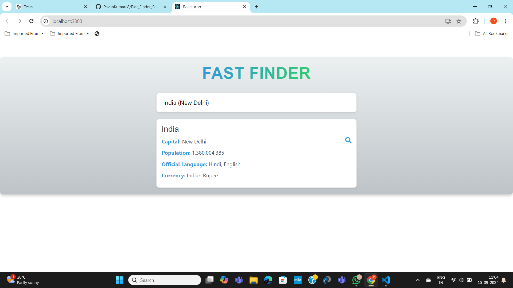

# Fast Finder 🌍🔍

[](https://app.netlify.com/sites/pavan-fast-finder-search-bar/deploys)

Fast Finder is a React-based web application that allows users to search for countries by their name or capital. It provides detailed information such as the country's capital, population, official languages, and currency. The app also features an autocomplete search bar for enhanced user experience.

## Features ✨
- Search for countries by name or capital.
- Provides information about population, official languages, and currency.
- Autocomplete suggestions as you type.
- Clickable search button or hit **Enter** to trigger the search.
- Responsive and user-friendly design.

## Screenshots 📸


## Demo 🎥
Check out the live version here: [Fast Finder on Netlify](https://pavan-fast-finder-search-bar.netlify.app/)

## Getting Started 🚀

### Prerequisites
- Node.js (>=14.0)
- npm or yarn

### Installation

1. Clone the repository:
   ```bash
   git clone https://github.com/your-username/your-repo-name.git
   cd your-repo-name
   ```

2. Install the dependencies:
   ```bash
   npm install
   ```

3. Start the development server:
   ```bash
   npm start
   ```

### Building for Production
To create an optimized build for production:

```bash
npm run build
```

This will create a `build/` folder with the production-ready app.

## Technologies Used 🛠️
- **React.js**: Front-end library.
- **Axios**: For data fetching.
- **React Icons**: For icons used in the UI.
- **CSS**: For styling the application.
- **JSON**: Static data for countries.

## File Structure 📁
```
.
├── public
│   ├── favicon.ico
│   ├── index.html
│   └── manifest.json
├── src
│   ├── components
│   │   ├── SearchBar.js
│   │   ├── SearchResults.js
│   ├── assets
│   │   ├── logo.svg
│   └── countries.json
├── App.js
├── App.css
├── index.js
├── README.md
└── package.json
```

## Contributing 📝
Contributions are welcome! Please follow these steps to contribute:
1. Fork the repository.
2. Create a new branch (`git checkout -b feature-branch`).
3. Make your changes.
4. Commit your changes (`git commit -m 'Add some feature'`).
5. Push to the branch (`git push origin feature-branch`).
6. Open a pull request.

## License 📄
This project is licensed under the MIT License - see the [LICENSE](LICENSE) file for details.

## Acknowledgments 🙏
- **React.js Documentation** for guidance.
- **Axios** for making HTTP requests easy.
- **Netlify** for free and simple deployment.

---

Made with ❤️ by [Pavan Kumar Pattipu](https://github.com/PavanKumarc8)

### Key Sections:
- **Title and Description**: Includes a short, clear description of the app.
- **Features**: Highlights key functionality.
- **Screenshots and Demo**: Provide visual examples and a live demo link.
- **Getting Started**: Detailed instructions for setting up the app locally.
- **Technologies**: List of major technologies used.
- **File Structure**: Shows how the app is organized.
- **Contributing**: Invites others to contribute.
- **License**: If you're open-sourcing the project, mention the license.
